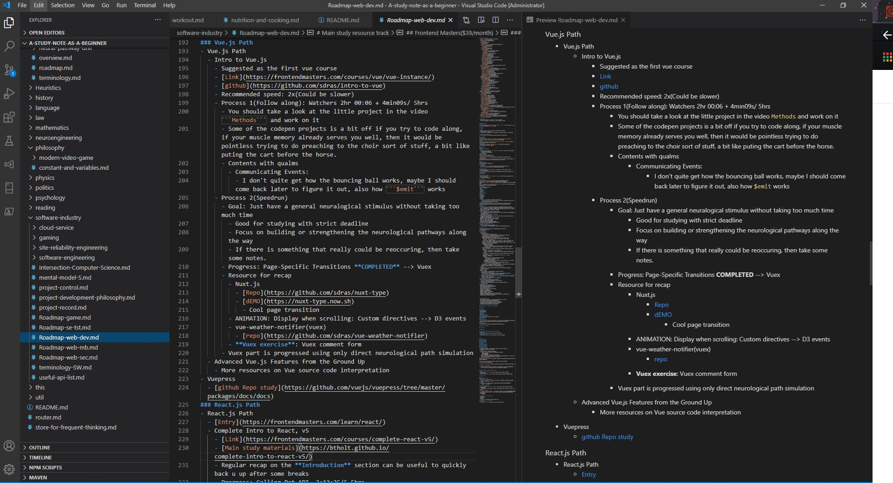

# Portals
- [Portals](#portals)
- [Explore the definition of **study framework**](#explore-the-definition-of-study-framework)
- [Demo](#demo)
- [Usage](#usage)
  - [PC](#pc)
  - [Mobile](#mobile)
- [Notebook architecture](#notebook-architecture)
- [Keyboard shortcuts](#keyboard-shortcuts)


# Explore the definition of **study framework**
- Theoretical
  - High-level 
    - A framework prompts you to think in a certain pattern or a path, like what hooks in the ```react``` does, which, in long-term, can be beneficial.
    - A framework should be either opinionated or unopinionated, but the best case scenario is for every individual from different fields to adjust/fine tune their study methods and according tools and utilities.
    - A framework should take the psychological, physiological and intellectual status of the user into the equation.
    - A framework should be able to constantly absorb the evidence-based scientific research concerning study as well as the anecdotal stories and upgrade itself.
  - Low-level
    - Functionality
      - A intellectual coach
        - Customized active-recall tools
      - An information hub
        - All information should be strongly coupled together
        - Customized study tools for a certain task
      - Recommendation system
- Practical
  - SE implementation
    - Cybersecurity
  - Entities to consider
    - Marginnote
    - Mindmap e.g. Xmind
    - Game experience
      - Minecraft
      - CYPHER
    - Flashcard
    - Knowledge graph
    - Neuroscience <--> Study theory
- More information
  - [Conceptual framework - wiki](https://en.wikipedia.org/wiki/Conceptual_framework)
  - [Involution - wiki](https://en.wikipedia.org/wiki/Involution_(mathematics))

# Demo
- [demo](https://warm-oasis-28882.herokuapp.com/)
- Recommended clone the repo instead, it's the thought that counts
# Usage
## PC
- Clone the repo
- Open the project with vscode
  - [For vscode utility](./software-industry/software-engineering/generic-tools/vscode.md)
- Explore



## Mobile
- Install GitHub app
- View the project
# Notebook architecture
- Root
  - reading
    - Explore the online reading resource and track the  progress both mentally and physicallly
    - Also works for managing the reading progress for paper-cover books around your desks, just you can't access it immediately if you have the spur to read it.
  - heuristics     
    - Methodologies and testing grounds
    - Any new ideas, strange or not
  - health-for-engineers-and-scientists
    - workout plans, why-bothers, cooking recipe， working/nutrition resource, movement arsenals
    - For engineers and scientists, from the perspective of a software engineer
  - \[customized_subject\]
    - terminology
      - Serves as a dictionary
      - Very flexible, you can add video Links, books, different explanations from a variety of sources, you can even track the tutorial progress here.
      - 中文-English-Deutsch-Français-Italiano
      - Use Ctrl+F for searching/ traditional *table of contents*
    - roadmap 
      - Stores the online resources, tutorials and track every progress to matter of seconds or a single thought
    - mental model
      - Acting as a training coach and progress tracker for intellectual skills training and a visualization training cookbook
    - \[nested_customized_subsubject\]
      - Sub-Topic-oriented Notes
      - \[Recursion\]
  - Store for frequent thinking
    - For storing the questions that you want to think over when pinching a loaf or wandering around
- Utilities(Under construction)


# Keyboard shortcuts
- Be familiar with vscode keyboard shortcuts first(w10)
  - I want to open this notebook after a day of hangover
    - Win+V --> open visual studio
    - Ctrl+R --> \[this repo name\] --> open this project
    - Ctrl+Shift+E --> toggle file system sidebar
    - Ctrl+P \[file name cues\] --> Quickly open a file deeply rooted anywhere
    - Toggle split tab: Ctrl+|(shift+\\)
    - ```markdown all in one```--> preview: Ctrl+Shift+V

  - Other Navigations
    - Switch between different virtual desktop
      - W10: Ctrl+win+left/right
    - Move things around virtual desktops
      - Win+tab --> move things around
    - Duplicate workplace to study in another virtual desktop
      - Ctrl+Shift+P >dupli...(autocomplete) 
    - Move tabs in vscode around
      - Select a sub tab: Ctrl+1/2/3/4... 
      - Move a sub tab to the right: Ctrl+Alt+Right/Left
- Work with web browsers
  - Chrome
    - Extensions
      - Vimium
        - Once installed, press F to show all page elements and its shortcut
        - Use these shortcut to quickly access the page without touching the mouse