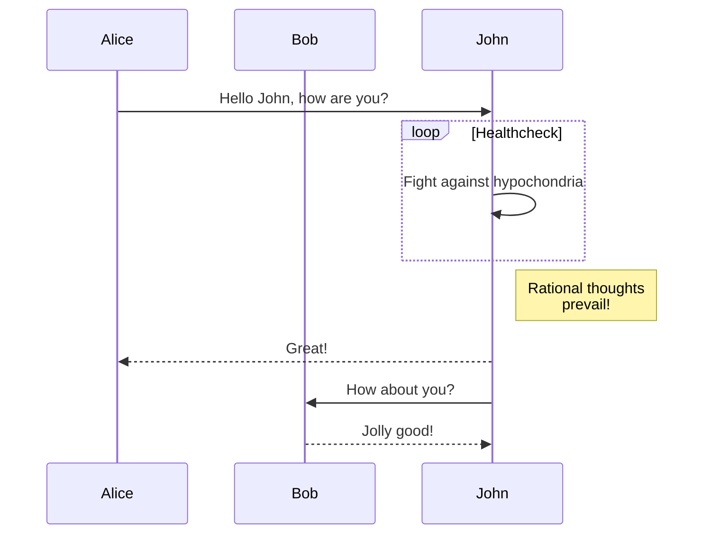
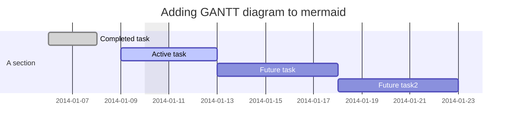
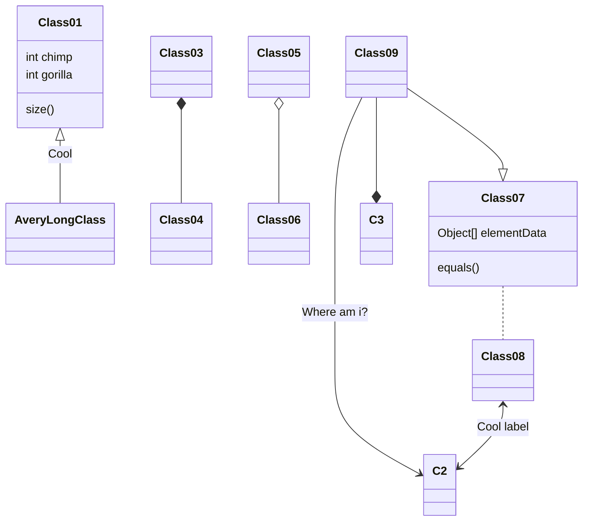

# Table of Contents
- [Table of Contents](#table-of-contents)
- [2020/11/18](#20201118)
# 2020/11/18
- Important and urgent
    - BLACK
      - Purchase order and sales order management
      - Warehouse management
    - Contact the developer of the french website we talked about
      - [Website](http://blitz3dfr.free.fr/)
      - Can we cooperate
      - We want to use their technology
      - First contact
        - Complement
        - Who we are
          - Does it require the completion of our website?
        - Commercial coorperation
    - YISHI(IMPORTANT)
      - goal:
        - Show THE ABILITY TO PLANNING AND DESIGN
      - demo
        - REQ
          - Environment --> demo
          - SHUCHANG: proposal --> 
            - Manufacturing ENV
            - Experience:
              - Static
              - Or pseudo-3D
              - Similar to JINGCI cloud showroom --> Better
      - Search for good examples for SHUCHANG
        - For him to design better
      - Time control
        - 1-2 Weeks(11/18-->!)
    - WEICHI
      - Huang: not familiar with 3D
      - Zhang: Contacting another company --> 19 morning talk about this topic
    - Inkdeeps
      - Static page
      - Publish
        - One key to the end
          - Regardless of the aesthetics
          - Layout, responsive design

