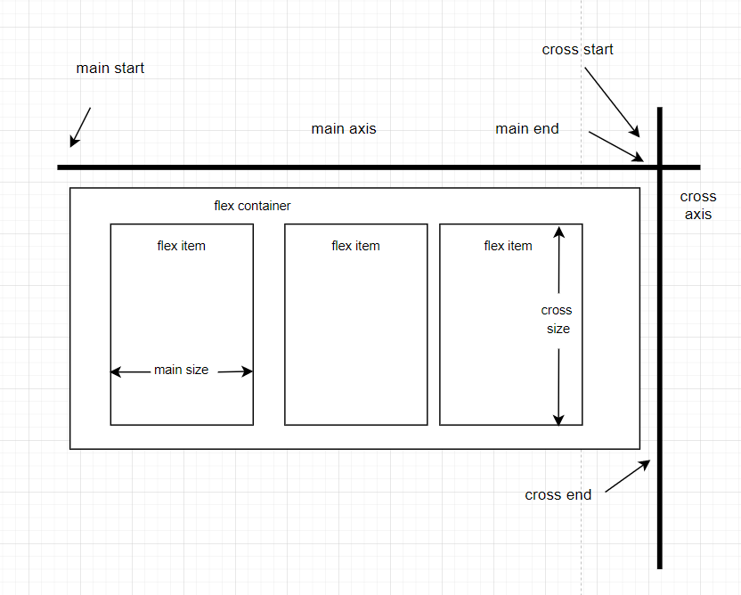

# Table of Contents
- [Table of Contents](#table-of-contents)
- [Introduction](#introduction)
- [Normal flow](#normal-flow)
  - [Resource](#resource)
- [Positioning](#positioning)
  - [```left | right | top | bottom```](#left--right--top--bottom)
  - [```clear```](#clear)
  - [```position```](#position)
  - [```z-index```](#z-index)
  - [```float```](#float)
  - [Resource](#resource-1)
- [Flexbox](#flexbox)
  - [What is flexbox?](#what-is-flexbox)
  - [Flexible box model](#flexible-box-model)
    - [Basic concept](#basic-concept)
    - [Anatomy](#anatomy)
    - [Mental model](#mental-model)
  - [Properties](#properties)
    - [```display: flex | inline-flex```](#display-flex--inline-flex)
    - [```flex-direction: row | column```](#flex-direction-row--column)
    - [```flex-warp: warp | nowrap | wrapreverse```](#flex-warp-warp--nowrap--wrapreverse)
    - [```justify-content: flex-start | flex-end | center```](#justify-content-flex-start--flex-end--center)
      - [```align-self: flex-start | flex-end | center```](#align-self-flex-start--flex-end--center)
      - [```align-items: flex-start | flex-end | center```](#align-items-flex-start--flex-end--center)
      - [```align-content: flex-start | flex-end | center```](#align-content-flex-start--flex-end--center)
      - [```flex```](#flex)
      - [```flex-basis: <length>```](#flex-basis-length)
      - [```flex-grow: <number> ```](#flex-grow-number-)
      - [```flex-shrink: <number>```](#flex-shrink-number)
      - [`flex-direction`](#flex-direction)
      - [```flex: <integer>```](#flex-integer)
      - [```order:<integer>```](#orderinteger)
  - [Topics](#topics)
    - [The difference between ```justify-content``` and ```align-item```](#the-difference-between-justify-content-and-align-item)
    - [Overflow???](#overflow)
    - [Examples](#examples)
- [Grids](#grids)
- [Floats](#floats)
- [Multiple-column layout](#multiple-column-layout)
- [Responsive design](#responsive-design)
  - [Media queries](#media-queries)
- [Multiple browser support](#multiple-browser-support)
- [Responsive page](#responsive-page)
  - [CSS rules](#css-rules)
    - [```@media screen and (maxwidth: <number>px)```](#media-screen-and-maxwidth-numberpx)
  - [Js Methods](#js-methods)
  - [```getBoundingClientRect()```](#getboundingclientrect)
- [Resource](#resource-2)
# Introduction
# Normal flow
- Individual element boxes are laid out by taking the element's content, then adding any padding, border and margin around them.(Similar to the box model)
- By default, a **block-level element**'s content is 100% of the width of its parent element, and as tall as its content. 
## Resource
- [Normal Flow - MDN](https://developer.mozilla.org/en-US/docs/Learn/CSS/CSS_layout/Normal_Flow)
# Positioning
## ```left | right | top | bottom```
## ```clear```
## ```position```
## ```z-index```
## ```float```

## Resource
For more check out [CSS Positioned Layout](https://developer.mozilla.org/en-US/docs/Web/CSS/CSS_Positioning)
# Flexbox
## What is flexbox?
A flexbox is a CSS3 layout mode that provides an easy and clean way to arrange items within a container.
- No floats
- Responsive and mobile friendly
- Positioning child elements is much easier
- Flex container's margins do not collapse with the margins of its contents.
- Order of elements can easily be canged without editing the source HTML
## Flexible box model
### Basic concept
- The ability to alter item width and height to best fit in its containers available free space.
- Flexbox is direction-agonistic
- Built for small-scale layouts while the upcoming "Grid" specifications is for more large scale
### Anatomy
|  |
|:--:|
| *Flexbox anatomy* |

### Mental model

## Properties
### ```display: flex | inline-flex```
### ```flex-direction: row | column```
### ```flex-warp: warp | nowrap | wrapreverse```
### ```justify-content: flex-start | flex-end | center```
**Mental model**

**center**

**start**

**end**

**space-around**

**flex-start**

**flex-end**

**left**

**right**

**space-between**

**space-around**


For more check out [MDN](https://developer.mozilla.org/en-US/docs/Web/CSS/justify-content)

#### ```align-self: flex-start | flex-end | center```
#### ```align-items: flex-start | flex-end | center```
#### ```align-content: flex-start | flex-end | center```
#### ```flex```
The **flex** CSS property sets how a flex *item* will grow or shrink to fit the space available in its flex container. It is a *shorthand* for ```flex-grow```, ```flex-shrink```, and ```flex-basis```.
#### ```flex-basis: <length>```
The ```flex-basis``` CSS property sets the initial main size of a flex item. It sets the size of the content box unless otherwise set with ```box-sizing```.
```css
.someClass {
  /* Specify <'width'> */
  flex-basis: 10em;
  flex-basis: 3px;
  flex-basis: auto;

  /* Intrinsic sizing keywords */
  flex-basis: fill;
  flex-basis: max-content;
  flex-basis: min-content;
  flex-basis: fit-content;

  /* Automatically size based on the flex item's content */
  flex-basis: content;

  /* Global values */
  flex-basis: inherit;
  flex-basis: initial;
  flex-basis: unset;
}
```

Training: 
- Go to 
#### ```flex-grow: <number> ```
#### ```flex-shrink: <number>```
#### `flex-direction`
- [Flexbox Tutorial - 5 - Flex direction](https://www.youtube.com/watch?v=ujXa2wQnAuU)
#### ```flex: <integer>```
#### ```order:<integer>```

## Topics
### The difference between ```justify-content``` and ```align-item```
### Overflow???
### Examples
# Grids
# Floats
# Multiple-column layout
# Responsive design
## Media queries
# Multiple browser support

# Responsive page
## CSS rules
### ```@media screen and (maxwidth: <number>px)```
## Js Methods
## ```getBoundingClientRect()```

# Resource
- [CSS layout - MDN](https://developer.mozilla.org/en-US/docs/Learn/CSS/CSS_layout)
- [Flexbox CSS In 20 Minutes](https://www.youtube.com/watch?v=JJSoEo8JSnc) 7:34/19:58
  - [Codepenn](https://codepen.io/zhutoutoutousan/pen/gOPwOOa) 
- [Flexbox - MDN](https://developer.mozilla.org/en-US/docs/Learn/CSS/CSS_layout/Flexbox)
- [CSS Grid Layout Crash Course - Traversy Media](https://www.youtube.com/watch?v=jV8B24rSN5o)
- [Grid CSS Responsive Website Layout - "Mobile First" Design](https://www.youtube.com/watch?v=M3qBpPw77qo)