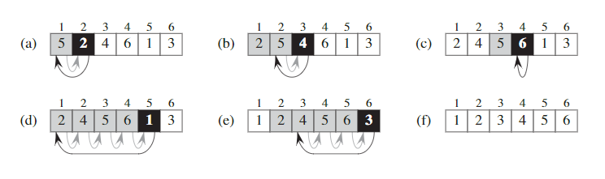

# Table of Contents
- [Table of Contents](#table-of-contents)
- [Formal problem description](#formal-problem-description)
- [Algorithm description](#algorithm-description)
  - [Pseudocode](#pseudocode)
- [Algorithm correctness verification](#algorithm-correctness-verification)
  - [Loop invariant](#loop-invariant)
    - [Why loop invariant?](#why-loop-invariant)
    - [What loop invariants look like](#what-loop-invariants-look-like)
    - [Why loop invariant?](#why-loop-invariant-1)
    - [Cases](#cases)
      - [Insertion sort](#insertion-sort)
    - [Under the hood: Why loop variant can prove the correctness of an algorithm?](#under-the-hood-why-loop-variant-can-prove-the-correctness-of-an-algorithm)
- [Algorithm analysis](#algorithm-analysis)
  - [Basic concepts](#basic-concepts)
    - [Random-access machine](#random-access-machine)
      - [Property](#property)
  - [Analysis methods](#analysis-methods)
    - [Example](#example)
      - [Insertion sort](#insertion-sort-1)
        - [Time consumption](#time-consumption)
        - [Order of growth](#order-of-growth)
- [Algorithm design](#algorithm-design)
  - [Design approaches](#design-approaches)
    - [Incremental approach](#incremental-approach)
    - [Divide and conquer](#divide-and-conquer)
      - [Recursion level](#recursion-level)

# Formal problem description

# Algorithm description
## Pseudocode

# Algorithm correctness verification
## Loop invariant
### Why loop invariant?
Check out [wiki](https://en.wikipedia.org/wiki/Loop_invariant)


### What loop invariants look like
```
avg(A[1...n]){
    tmp = 0
    for(i = 1 to n)
        tmp = tmp + A[i] // Holds here, after this line runs
    return tmp/n
}
```
Always, every time through the loop: $tmp = \sum_{j=1}^i A[j]$
Already seen that it holds 1st time through: i == 1, tmp == A\[1\]

- **Initialization:** ${tmp}_{i=1} = (\sum_{i=1}^{i=1} A[j]) = A[1]$
- **Maintenance:** Given: it holds on the $i$th iteration: $tmp = \sum_{j=1}^i A[j]$, prove it holds on the $i+1$st: ${tmp}' = \sum_{j=1}^{i'} A'[j]$. Proof: ${tmp}' = tmp + \sum_{j=1}^i A[j] + A[i+1] = \sum_{j=1}^{i'} A'[j]$
- **Termination:** ${tmp}_{i=n} = \sum_{i=1}^{i=n} A[j]$, returns $tmp/m = \sum_{j=1}^{j=n} A[j]/n$

[Program Proofs and Loop Invariants](https://www.youtube.com/watch?v=3YP6NP1_tF0)

[Hoare logic](https://en.wikipedia.org/wiki/Hoare_logic)

### Why loop invariant?
A loop invariant is a set of data---though the position may be altered---the integrity of which remains unchanged.

We use loop invariants to help understanding why an algorithm is correct. We must show three things about a loop invariant:
- **Initialization:** It is true prior to the first iteration of the loop.
- **Maintenance:** If it is true before an iteration of the loop, it remains true before the next iteration.
- **Termination:** When the loop terminates, the invariant gives us a useful property that helps show that the algorithm is correct.

When the first two properties hold, the loop invariant is true prior to every iteration of the loop. Note the similarity to mathematical induction, where to prove that a property holds, you prove a base case and an inductive step. 

The third property is perhaps the most important one. Typically, we use the loop invariant along with the condition that caused the loop to terminate. The termination property differs from how we usually use mathematical induction, in which we apply the inductive step infinitely.

### Cases
#### Insertion sort
**Input:** A sequence of $n$ numbers $\langle a_1, a_2, ..., a_n \rangle$.

**Output:** A permutation(reordering) $\langle {a_1}', {a_2}', ..., {a_n}' \rangle$ of the input sequence such taht ${a_1}' \leq {a_2}' \leq ... \leq {a_n}'$

|  |
| :--: |
| **Figure 1** Insertion sort|

```
// The key correspond to the index number of the highlighted black blocks, and i traverse over all the grey blocks in Figure 1
for j = 2 to A.length
    key = A[j]
    // Insert A[j] into the sorted sequence A[1..j - 1]
    i  = j - 1
    while i > 0 and A[i] > key
        A[i+1] = A[i]
        i = i - 1
    A[i+1] = key
```
Proof check out *Introduction to algorithms* Page 19

Mental model:
- Very similar to the way you sort poker decks
### Under the hood: Why loop variant can prove the correctness of an algorithm?
[CS 170 Tutorial #1 Invariants and Proofs of Correctness](http://www-inst.cs.berkeley.edu/~cs170/fa14/tutorials/tutorial1.pdf)

# Algorithm analysis
## Basic concepts
### Random-access machine
#### Property
- In the RAM model, instructions are executed one after another, with no concurrent operations.
- The RAM model contains instructions commonly found in real computers: arithmetic(such as add, subtract, multiply, divide, remainder, floor, ceiling), data movement(load, store, copy), and control(conditional and unconditional branch, subroutine call and return).Each such instruction takes a constant amount of time.
- Ignoring memory hiearchy

For more, check out [this](https://en.wikipedia.org/wiki/Random-access_machine)

## Analysis methods
### Example
#### Insertion sort
##### Time consumption
Let $t_j$ denote the number of times the **while** loop test in *line 5* is executed for that value of *j* for each $j = 2,3,...,n$, where $n = A.length$. When a **for** or **while** loop exits in the usual way(i.e. due to the test in the loop header), the test is executed one time more than the loop body. Assuming comments takes no time.
| INSERTION-SORT(A) | cost | times |
| ----------------- |:----:| -----:|
| 1 ```for j = 2 to A.length``` | $c_1$ | n |
| 2 &nbsp; &nbsp; ```key = A[j]``` | $c_2$ | n - 1 |
| 3 &nbsp; &nbsp; ```//Insert A[j] into the sorted sequence $A[1..j-1]$.``` | 0 | n - 1 | 
| 4 &nbsp; &nbsp; ```i = j - 1``` | $c_4$ | n - 1 |
| 5 &nbsp; &nbsp; ```while i > 0 and A[i] > key```| $c_5$ | $\sum_{j=2}^n t_j$ | 
| 6 &nbsp; &nbsp; &nbsp; ```A[i+1] = A[i]``` | $c_6$ | $\sum_{j=2}^n (t_j-1)$ |
| 7 &nbsp; &nbsp; &nbsp;  ``` i = i - 1``` | $c_7$ | $\sum_{j=2}^n (t_j - 1)$ |
| 8 &nbsp; &nbsp; ```A[i+1] = key``` | $c_8$ | n -1 |

The running time of the algorithm is the sum of running times for each statement executed; a statement takes $c_i$ steps to execute and executes $n$ times will contribute $c_in$ to the total running time.*(Not applicable for a resource such as memory, A statement that references *m* words of memory and is executed *n* times does not necessarily reference *mn* distinct words of memory.)*

To compute $T(n)$, the running time of INSERTION-SORT on an input of *n* values, by summing the products of the *cost* and *times* columns, we obtain:

$$
T(n) = c_1n + c_2(n-1) + c_4(n-1) + c_5\sum_{j=2}^n t_j + c_6\sum_{j=2}^n(t_j-1) + c_7\sum_{j=2}^n (t_j-1) + c_8(n-1).
$$

Now for the **best case analysis**, which is the case that the array is already sorted. For each $j = 2,3,...,n$, we then find that $A[i] \leq key$ in line 5 when *i* has its initial value of *j - 1*. Thus $t_j = 1$ for $j = 2,3,...,n$, and the best-case running time is:

$$
T(n) = c_1n + c_2(n-1) + c_4(n-1) + c_5(n-1) + c_8(n-1) \\= (c_1+c_2+c_4+c_5+c_8)n - (c_2+c_4+c_5+c_8)
$$

We can express this running time as $an+b$ for *constants* $a$ and $b$ that depend on the statement costs $c_i$; itis thus a **linear function** of n.

For the **worst case analysis**, the array will be in reverse sorted order(i.e. in decreasing order). Now we must compare each element ```A[j]``` with each element in the entire sorted subarray ```A[1..j-1]```, and so $t_j = j$ for $j=2,3,...,n$. According to the summation formulae, we know that: 

$$
\sum_{j=2}^n j = \frac{n(n+1)}{2} - 1
$$

and

$$
\sum_{j=2}^n (j-1) = \frac{n(n-1)}{2}
$$

Then in the worse case, the running time of INSERTION-SORT is:

$$
T(n) = c_1n+c_2(n-1)+c_4(n-1)+c_5((\frac{n(n+1)}{2})-1) \\
+c_6(\frac{n(n-1)}{2})+c_7(\frac{n(n-1)}{2})+c_8(n-1) \\
=(\frac{c_5}{2}+\frac{c_6}{2}+\frac{c_7}{2})n^2+(c_1+c_2+c_4+\frac{c_5}{2}-\frac{c_6}{2}-\frac{c_7}{2}+c_8)n-(c_2+c_4+c_5+c_8)
$$

This worst-case running time as $an^2+bn+c$ for constants $a,b$ and $c$ that again depend on the statement consts $c_i$; it is thus a **quadratic function** of $n$.

  *The rigorous analysis serves more as a reference* 
##### Order of growth
What is ignored:
- The actual cost of each statement.(Using a constant to replace)
- The leading term's constant coefficient of the running time formula obtained by the analysis demonstrated above.

This sort has the worst-case running time of $\Theta(n^2)$ 

# Algorithm design
## Design approaches
### Incremental approach
For example, insertion sort.
### Divide and conquer
Most **recursive** algorithms follow a **divide-and-conquer** approach.
#### Recursion level
- **Divide**: the problem into a number of subproblems that are smaller instances of the same problem.
- **Conquer**: the subproblems by solving them recursively. If the subproblem sizes are small enough, however, just solve the subproblems in a straightforward manner.
- **Combine**: the solutions to the subproblems into the solution for the original problem.

