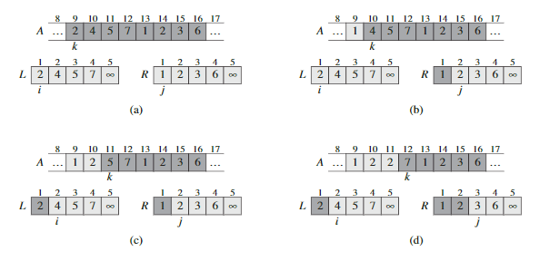

# Table of Contents
- [Table of Contents](#table-of-contents)
- [Definition](#definition)
- [Insertion sort](#insertion-sort)
  - [Basics](#basics)
  - [Realization](#realization)
    - [Pseudocode](#pseudocode)
    - [JavaScript](#javascript)
  - [Real-life applications](#real-life-applications)
    - [Leetcode](#leetcode)
    - [Front-end development](#front-end-development)
    - [Back-end development](#back-end-development)
    - [Machine learning](#machine-learning)
- [Merge sort](#merge-sort)
  - [Basics](#basics-1)
  - [Realization](#realization-1)
    - [Pseudocode](#pseudocode-1)
    - [JavaScript](#javascript-1)
- [Quick sort](#quick-sort)
# Definition
**Input:** A sequence of $n$ numbers $\langle a_1, a_2, ..., a_n \rangle$.

**Output:** A permutation(reordering) $\langle {a_1}', {a_2}', ..., {a_n}' \rangle$ of the input sequence such thatt ${a_1}' \leq {a_2}' \leq ... \leq {a_n}'$

# Insertion sort
## Basics
|  |
| :--: |
|* **Figure 1** How insertion works*|
## Realization
### Pseudocode
```
// The key correspond to the index number of the highlighted black blocks, and i traverse over all the grey blocks in Figure 1
for j = 2 to A.length
    key = A[j]
    // Insert A[j] into the sorted sequence A[1..j - 1]
    i  = j - 1
    while i > 0 and A[i] > key
        A[i+1] = A[i]
        i = i - 1
    A[i+1] = key
```
### JavaScript
```javascript
// for loop
const insertSort = (arr) => {
    for(let j = 1; j < arr.length; j++){
        let i = j - 1;
        let key = arr[j];
        while(i >= 0 && arr[i] > key){
            arr[i+1] = arr[i];
            i--;
        } 
        arr[i+1] = key;
    }
    return arr;
}

// higher order function
// https://stackoverflow.com/questions/50245957/sorting-array-with-javascript-reduce-function
const ReduceSort = arr => arr.reduce((sorted, el) => {
    let index = 0;
    while(index < arr.length && el < arr[index]) index++;
    sorted.splice(index, 0, el);
    return sorted;
},[])

const jsSort = arr => arr.sort((a,b) => a-b);

const test = (func, num, scale) => {
    const sample = new Array(num).fill(0).map(x => 
        x + Math.floor(Math.random() * scale));    
    console.log(sample)
    console.log(func)
    console.time(`${func.name}`)
    let results = func(sample)
    console.timeEnd(`${func.name}`)
    console.log(results);
    for(let i = 0; i < results.length - 1; i++){
        if(results[i] > results[i+1]){
            console.log(`fail in ${func.name}`);
            return;
        }
    }

    console.log(`succeed in ${func.name}`);
}

test(insertSort, 100000, 500); // 4684ms
test(jsSort,100000,500); // 41.25ms
test(ReduceSort,100000,500)  // Failed 2300ms
```

## Real-life applications
### Leetcode
### Front-end development
### Back-end development
### Machine learning

# Merge sort
## Basics
The **merge sort** algorithm closely follows the divide-and-conquer paradigm. Intuitively, it operates as follows:  
- **Divide**: Divide the $n$-element sequence to be sorted into two subsequences of $n/2$ elements each  
- **Conquer**: Sort the two subsequences recursively using merge sort.
- **Combine**: Merge the two sorted subsequences to produce the sorted answer.

The key operation of the merge sort algorithm is the merging of two sorted sequences in the "combine" step.

Here, we define ```MERGE(A,p,q,r)```, where ```A``` is an array and ```p```,```q``` and ```r``` are indices into the array such that $p\leq q \leq r$. The procedure assumes that the subarrays $A[p..q]$ and $A[q+1..r]$ are in sorted order. It **merges** them to form a single sorted subarray that replaces the current subarray $A[p..r]$

||
| :--: |
|* **Figure 2** MERGE（A,9,12,16)*|

## Realization
### Pseudocode
### JavaScript 

# Quick sort