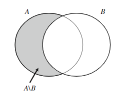

# Basic definitions
## Set
### Set.definition
A set is a collection of **elements**(or **points**) that are definite and separate objects.
### Set.relations
- $a$  is an element of a set   $S$  -->  $a \in S$  Otherwise  $a \notin S$
- **Subset**:  $X \subseteq Y$ --> Every element in $X$ is also an element in $Y$
- **Equal**: $X = Y$
- **proper subset**: $X \subset Y$ --> When $X \subseteq Y$ and $X \ne Y$
- **Intersection**: $X \cap Y$ consists of elements that are contained in both $X$ and $Y$
- **Union**: $X \cup Y$ consists of all the elments contained in either $X$ or $Y$, including both.
- **Disjoint**: When $X \cap Y = \emptyset$, $X$ and $Y$ are said to be disjoint.
- **Difference**: $A \setminus B$ --> For two sets $A$ and $B$, difference: $\{x: x \in A, x \notin B \}$
- **Universal set**:
### Set.instance
- $X=\{x_1,x_2,x_3,...,x_n\}$  --> $X$  is a set with  $n$  elements:  $x_1,x_2,...x_n$
- A **finite**(**ifinite**) **set**: A set that contains a finite(infinite) number of elements.
- Empty Set:  $\emptyset$  
### Set.geometry
#### $A \setminus B$ display

# Solved problems

# Current problems