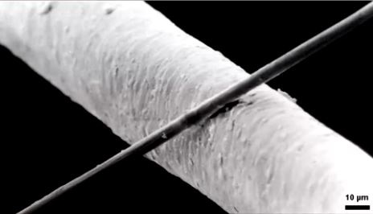

# Visualization
- A normal human brain usually weighs 3 lbs, consuming 10 times of the energy by weight than the rest of the body
- Synapse
  - Synapses are less than a micron in diameter.(A human hair is around 20 microns in diameter)
    
 *Human hair compared to a carbon tube that is the diameter of a synapse* 
  - There are a million billion synapses in the brain
    - Comparing to?
- The insular cortex is usually related with pain.
- The working memory is centered out of the prefrontal cortex
- The working memory can store only about four chunks of information