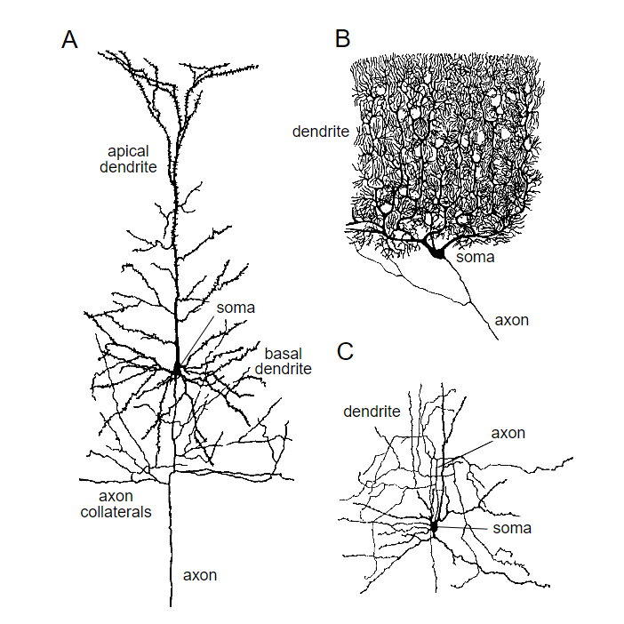

# Neuron
## Neuron.types
## Neuron.prototype.apperance

- A: A cortical pyramidal cell. These are the primary excitatory neurons of the cerebral cortex.
## Neuron.prototype.property
### Neuron.prototype.property.structure
#### Soma(Cell body)
This is the part that all cells have, this is cell central.
#### Nucleus
With the DNA, this is like city hall, it's gonna give out all the orders.
#### 
### Neuron.prototype.property.function
## Neuron.prototype.significance