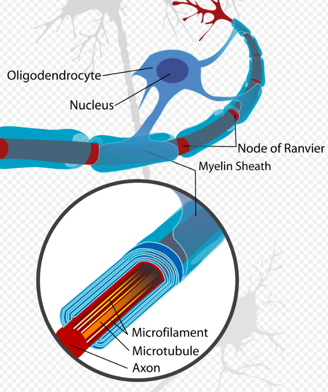

# Table of Contents
- [Table of Contents](#table-of-contents)
- [A](#a)
  - [Action potential(Spike)](#action-potentialspike)
  - [Arbor](#arbor)
  - [Axon](#axon)
    - [Myelinated axon](#myelinated-axon)
    - [Naked axon](#naked-axon)
- [C](#c)
  - [Cell assembly](#cell-assembly)
  - [CNS](#cns)
  - [Cortical](#cortical)
  - [Collaterals](#collaterals)
- [D](#d)
  - [Dendrites](#dendrites)
    - [Dendrites.Dendritic-arbor](#dendritesdendritic-arbor)
  - [Descriptive models](#descriptive-models)
  - [Dopamine](#dopamine)
  - [Demyelination](#demyelination)
- [E](#e)
  - [Exc](#exc)
- [G](#g)
  - [Glia](#glia)
    - [Astrocytes](#astrocytes)
    - [Oligodendrocytes](#oligodendrocytes)
    - [Schwann cells](#schwann-cells)
    - [Microglia](#microglia)
    - [Trivia](#trivia)
- [I](#i)
  - [Interpretive models](#interpretive-models)
- [M](#m)
  - [Myelin](#myelin)
  - [Mechanistic models](#mechanistic-models)
- [N](#n)
  - [Neurotransmission](#neurotransmission)
    - [Neurotransmission.pathways.neurotransmitter](#neurotransmissionpathwaysneurotransmitter)
  - [Nerve fibers](#nerve-fibers)
  - [Neural code](#neural-code)
  - [Neuron](#neuron)
    - [Neuron.types](#neurontypes)
    - [Neuron.prototype.property](#neuronprototypeproperty)
      - [Neuron.prototype.excitability](#neuronprototypeexcitability)
      - [Neuron.prototype.anatomy](#neuronprototypeanatomy)
      - [Neuron.prototype.function](#neuronprototypefunction)
    - [Neuron.prototype.significance](#neuronprototypesignificance)
  - [Nucleus](#nucleus)
- [P](#p)
  - [PNS](#pns)
- [S](#s)
  - [Secretion](#secretion)
  - [Spinal cord](#spinal-cord)
# A
## Action potential(Spike)
## Arbor
## Axon
### Myelinated axon
- Information is transferred faster at a rate of 2-120m/s, with an average time of 12-750ms.
### Naked axon
- Information is transferred slower at a rate of 0.2-1.0m/s, with an average time of 1.5-7s.
# C
## Cell assembly
## CNS
Centeral nervous system
## Cortical
## Collaterals
# D
## Dendrites
### Dendrites.Dendritic-arbor
## Descriptive models
Descriptive models summarize large amounts of experimental data compactly yet accurately, thereby characterizing what neurons and neural circuits do. [Theoretical-neuroscience Preface](../resource/theoretical-neuroscience.pdf)
## Dopamine
## Demyelination
# E
## Exc
# G
## Glia
Supporters of neurons
### Astrocytes
- Comprise about 20% of the glia cells
- Cleaning up the wastes like excess ions, excess neuro-transmitters and their metabolites. 
- Mobilize the neuron.
- The synapses are enveloped in the processes of Astrocytes.
### Oligodendrocytes
- Produce myelin in CNS
- Comprise 75% of the central glia cells
### Schwann cells
### Microglia
- A hot topic
- Comprise 5% of the glia cells
- Immune cells invaded into the nervous system
- Related to Alzheimer's disease and other chronic brain diseases.
### Trivia
- Produce myelin in PNS
- According to Suzana Herculane Hovzel, a human brain generally contains about 86 billion neurons and 85 billion glia with a ratio of 0.99.

# I
## Interpretive models
[Theoretical-neuroscience Preface](../resource/theoretical-neuroscience.pdf)
# M
## Myelin
Myelin is a fatty wrap that goes around some axons.
|  |
| :--: |
| **Figure 1** Myelin|
## Mechanistic models
[Theoretical-neuroscience Preface](../resource/theoretical-neuroscience.pdf)
# N 
## Neurotransmission
### Neurotransmission.pathways.neurotransmitter
## Nerve fibers
## Neural code
## Neuron
### Neuron.types
### Neuron.prototype.property
#### Neuron.prototype.excitability
#### Neuron.prototype.anatomy
#### Neuron.prototype.function
### Neuron.prototype.significance
## Nucleus
# P
## PNS
Peripheral nervous system
# S
## Secretion
[Secretion - wikipedia](https://en.wikipedia.org/wiki/Secretion)
## Spinal cord