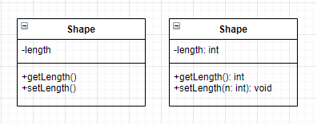

# Table of contents
- [Table of contents](#table-of-contents)
- [Are diagrams necessary for agile development?](#are-diagrams-necessary-for-agile-development)
- [Diagrams](#diagrams)
  - [Freestyle](#freestyle)
  - [Timeline](#timeline)
  - [State machine](#state-machine)
  - [UML Class diagram](#uml-class-diagram)
    - [Second thoughts](#second-thoughts)
    - [UML Class Notation](#uml-class-notation)
      - [Perspectives](#perspectives)
      - [Class diagram Anatomy](#class-diagram-anatomy)
      - [Visibility](#visibility)
      - [Parameter directionality](#parameter-directionality)
      - [Relationships between classes](#relationships-between-classes)
        - [Inheritance](#inheritance)
        - [Association](#association)
        - [Cardinality](#cardinality)
        - [Aggregation](#aggregation)
        - [Composition](#composition)
        - [Dependency](#dependency)
        - [Realization](#realization)
  - [Case study: UML diagram](#case-study-uml-diagram)
    - [Web crawler](#web-crawler)
    - [Chess game](#chess-game)
    - [Order system](#order-system)
    - [GUI](#gui)
  - [UML generator](#uml-generator)
    - [Java](#java)
    - [JavaScript](#javascript)
  - [Class and Object oriented programming](#class-and-object-oriented-programming)
    - [General](#general)
    - [Java](#java-1)
    - [JavaScript](#javascript-1)
      - [Resources](#resources)
  - [ER diagram](#er-diagram)
  - [Eiffel programming language](#eiffel-programming-language)
- [Tools](#tools)
  - [Draw.io](#drawio)
    - [Keyboard shortcuts](#keyboard-shortcuts)
    - [Customized Templates](#customized-templates)
    - [UML diagram](#uml-diagram)
  - [Excalidraw](#excalidraw)
# Are diagrams necessary for agile development?
# Diagrams
## Freestyle
## Timeline
## State machine
## UML Class diagram
The UML class diagram is a graphical notation used to construct and visualize object oriented systems. A class diagram in the Unified Modeling Language(UML) is a type of static structure diagram that describes the structure of a system by showing the system's:
- classes
- their attributes
- operations(or methods)
- and the relationship among objects

### Second thoughts
[UML 还有用吗？](https://www.zhihu.com/question/23569835)  
[Quora - On software architecture](https://www.quora.com/How-can-we-design-and-model-software-if-we-want-to-use-functional-programming-languages-and-there-are-no-classes-and-OOP-concepts-involved-Do-we-have-something-like-UML-for-functional-languages)
### UML Class Notation

|  |
|:--:|
| *Left:Class without signature  Right: Class with signature* |
#### Perspectives
#### Class diagram Anatomy
First partition: Class name  

Second partition: Class attribute
- The attribute type is shown after the colon
- Attributes map onto member variables(data members) in code.  

Third partition: Methods(class operations)
- Operations are shown in the third partition. They are services that the class provides.
- The return type of a method is shown after the colon at the end of the method signature.
- The return type of method parameters are shown after the colon following the parameter name. Operations map onto class methods in code.
#### Visibility
- '+' denotes public attributes or operations
- '-' denotes private attributes or operations
- '#' denotes protected attributes or operations.
#### Parameter directionality
#### Relationships between classes
##### Inheritance
##### Association
##### Cardinality
##### Aggregation
##### Composition
##### Dependency
##### Realization
## Case study: UML diagram
### Web crawler
### Chess game
### Order system
### GUI
## UML generator
### Java
### JavaScript

## Class and Object oriented programming
### General
### Java
### JavaScript

#### Resources
[UML Class Diagram Tutorial](https://www.visual-paradigm.com/guide/uml-unified-modeling-language/uml-class-diagram-tutorial/)

## ER diagram
For database
## Eiffel programming language

# Tools
## Draw.io
### Keyboard shortcuts
### Customized Templates
### UML diagram
## Excalidraw
[Excalidraw](https://excalidraw.com/)