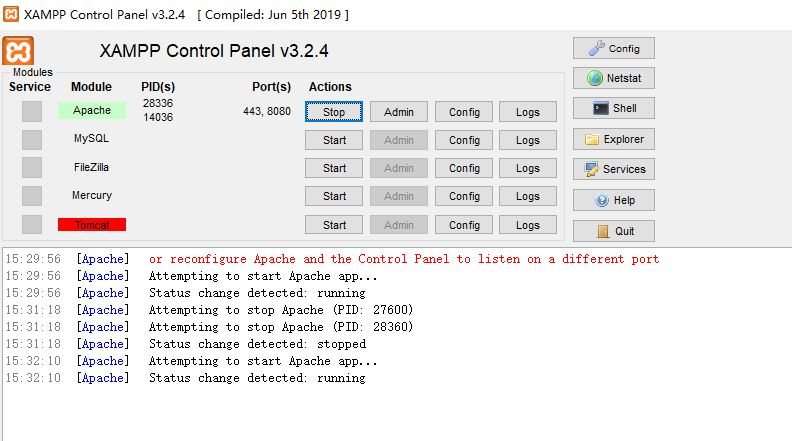
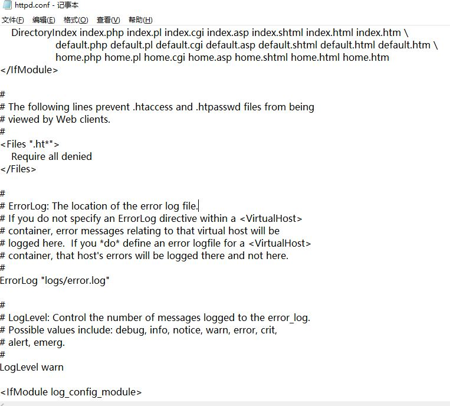
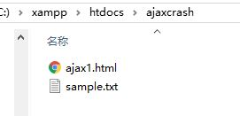

# AJAX入门(原生JS)
## 配置XAMPP
### 安装
[包下载地址](https://www.apachefriends.org/index.html)
下载，安装之后进入界面。

### Apache配置默认端口
点击Apache右栏中Config, 在弹出菜单中点选Apache...httpd.conf

搜索80端口，将80改成自己想要的端口
### 常见错误处理
[Error: Apache shutdown unexpectedly](https://w3guy.com/fix-xampp-error-apache-shutdown-unexpectedly/)

## 在Apache服务器上运行页面




# 参考资料
[AJAX Crash Course(Vanilla JavaScript)](https://www.youtube.com/watch?v=82hnvUYY6QA)
[markdown-cheatsheet](https://github.com/adam-p/markdown-here/wiki/Markdown-Cheatsheet)

# 小知识
## ```XMLHttpRequest()```
```javascript
let xhr = new XMLHttpRequest();
xhr.open([method], [target], [?synchronous])
```
