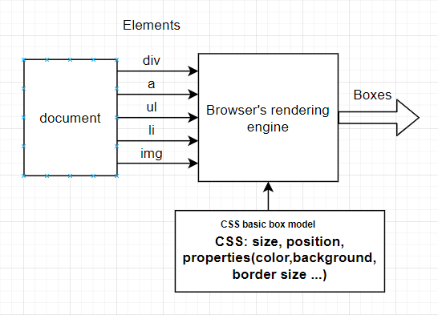

# Table of Contents
- [Table of Contents](#table-of-contents)
- [What CSS does](#what-css-does)
- [CSS box model](#css-box-model)
  - [Block boxes](#block-boxes)
    - [Mental model](#mental-model)
    - [Behaviour check-up](#behaviour-check-up)
  - [Inline boxes](#inline-boxes)
    - [Mental model](#mental-model-1)
    - [Behaviour check-up](#behaviour-check-up-1)
  - [Box display](#box-display)
    - [Mental model for *Inside* and *Outside*](#mental-model-for-inside-and-outside)
    - [Inside](#inside)
      - [block](#block)
      - [inline](#inline)
      - [none](#none)
      - [contents](#contents)
    - [Outside](#outside)
      - [flex](#flex)
      - [grid](#grid)
    - [Internal](#internal)
    - [Box](#box)
  - [Box position](#box-position)
    - [Absolute](#absolute)
    - [Relative](#relative)
    - [Sticky](#sticky)
    - [Resource](#resource)
- [Cascade and inheritance](#cascade-and-inheritance)
  - [Positioning, parents](#positioning-parents)
- [Initialization](#initialization)
- [Animation](#animation)
- [Mental model code connection](#mental-model-code-connection)
  - [Clock-wise](#clock-wise)
- [Resource](#resource-1)
# What CSS does
|  |
|:--:|
| *What CSS does* |
# CSS box model
|  |
|:--:|
| *Box model* |


## Block boxes
### Mental model
Think of this as a solid, arrogant, sturdy SOABox, which **stands out once present(Break onto a new line)**, and eat up all the spaces which contains it. However, you can **control its temper by whistling to its ear(The width and height properties are respected)**. But **when it loses its temper, its outer fatty layer can not be penetrated.**        

!: Relations with position property(relative VS absolute)
  - Do ```relative``` components and ```absolute``` components share different space? Maybe the idea of ```position: absolute``` precedes the idea of ```display: block```?
### Behaviour check-up
- The box will break onto a new line
- The box will extend in the line director to fill the space available in its container. In most cases this means the box will become as wide as the container, filling up 100% of the space available
- The width and height properties are respected
- Padding, margin and border will cause other elements to be pushed away from the box
## Inline boxes
### Mental model
### Behaviour check-up
- The box will not break onto a new line
- The ```width``` and ```height``` properties will not apply
- Vertical padding, margins, and borders will apply but will not cause other inline boxes
## Box display
### Mental model for *Inside* and *Outside*
### Inside
#### block
#### inline

#### none
Attention: The box still takes up space sometimes, adjust opacity for temporary relief. It's better to use [this method](https://gomakethings.com/hidden-content-for-better-a11y/#hiding-the-link).
#### contents
### Outside
#### flex
#### grid
### Internal
### Box
## Box position
### Absolute
Imagine the component is pinned on the exact position on the page.
### Relative
Imagine the additional ```potision``` propoerty is superimposed on the base of the parent node.
### Sticky
Imagine the component is sticked to its initial position on the screen whenever you scroll the page
### Resource
[css-tricks position](https://css-tricks.com/almanac/properties/p/position/)
For more on box, check out
[MDN - position](https://developer.mozilla.org/en-US/docs/Web/CSS/position)

# Cascade and inheritance
## Positioning, parents

# Initialization
Think about every initial value as you can in CSS when you don't initialize in the rules. What difference will it make?
- Padding: 0px 0px 0px 0px


# Animation
# Mental model code connection
## Clock-wise


# Resource
[MDN - The box model](https://developer.mozilla.org/en-US/docs/Learn/CSS/Building_blocks/The_box_model)


