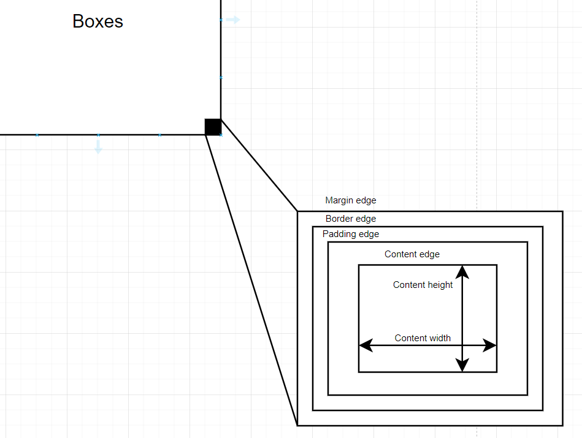

# What CSS does
|  |
|:--:|
| *What CSS does* |
# CSS box model
|  |
|:--:|
| *Box model* |

## Block boxes
### Mental model
Think of this as a solid, arrogant, sturdy SOABox, which **stands out once present(Break onto a new line)**, and eat up all the spaces which contains it. However, you can **control its temper by whistling to its ear(The width and height properties are respected)**. But **when it loses its temper, its outer fatty layer can not be penetrated.**
### Behaviour check-up
- The box will break onto a new line
- The box will extend in the line director to fill the space available in its container. In most cases this means the box will become as wide as the container, filling up 100% of the space available
- The width and height properties are respected
- Padding, margin and border will cause other elements to be pushed away from the box
## Inline boxes
### Mental model
### Behaviour check-up
- 
# Mental model code connection

# Resource
[MDN - The box model](https://developer.mozilla.org/en-US/docs/Learn/CSS/Building_blocks/The_box_model)

