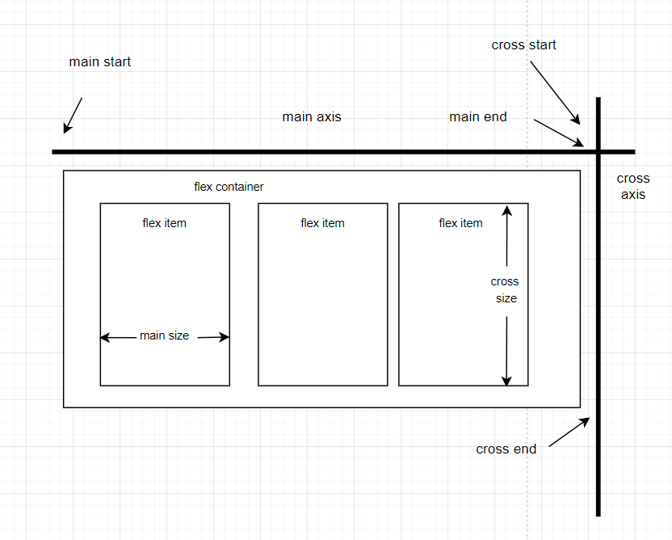

# Table of Contents
- [Table of Contents](#table-of-contents)
- [Introduction](#introduction)
- [Normal flow](#normal-flow)
- [Flexbox](#flexbox)
  - [What is flexbox?](#what-is-flexbox)
  - [Flexible box model](#flexible-box-model)
    - [Basic concept](#basic-concept)
    - [Anatomy](#anatomy)
    - [Mental model](#mental-model)
    - [Properties](#properties)
      - [```display: flex | inline-flex```](#display-flex--inline-flex)
      - [```flex-direction: row | column```](#flex-direction-row--column)
      - [```flex-warp: warp | nowrap | wrapreverse```](#flex-warp-warp--nowrap--wrapreverse)
      - [```flex-basis: <length>```](#flex-basis-length)
      - [```justify-content: flex-start | flex-end | center```](#justify-content-flex-start--flex-end--center)
      - [```align-self: flex-start | flex-end | center```](#align-self-flex-start--flex-end--center)
      - [```align-items: flex-start | flex-end | center```](#align-items-flex-start--flex-end--center)
      - [```align-content: flex-start | flex-end | center```](#align-content-flex-start--flex-end--center)
      - [```flex-grow: <number> ```](#flex-grow-number)
      - [```flex-shrink: <number>```](#flex-shrink-number)
      - [```flex: <integer>```](#flex-integer)
      - [```order:<integer>```](#orderinteger)
    - [Examples](#examples)
- [Grids](#grids)
- [Floats](#floats)
- [Positioning](#positioning)
- [Multiple-column layout](#multiple-column-layout)
- [Responsive design](#responsive-design)
  - [Media queries](#media-queries)
- [Multiple browser support](#multiple-browser-support)
- [Resource](#resource)
# Introduction
# Normal flow
# Flexbox
## What is flexbox?
A flexbox is a CSS3 layout mode that provides an easy and clean way to arrange items within a container.
- No floats
- Responsive and mobile friendly
- Positioning child elements is much easier
- Flex container's margins do not collapse with the margins of its contents.
- Order of elements can easily be canged without editing the source HTML
## Flexible box model
### Basic concept
- The ability to alter item width and height to best fit in its containers available free space.
- Flexbox is direction-agonistic
- Built for small-scale layouts while the upcoming "Grid" specifications is for more large scale
### Anatomy
|  |
|:--:|
| *Flexbox anatomy* |

### Mental model

### Properties
#### ```display: flex | inline-flex```
#### ```flex-direction: row | column```
#### ```flex-warp: warp | nowrap | wrapreverse```
#### ```flex-basis: <length>```
#### ```justify-content: flex-start | flex-end | center```
#### ```align-self: flex-start | flex-end | center```
#### ```align-items: flex-start | flex-end | center```
#### ```align-content: flex-start | flex-end | center```
#### ```flex-grow: <number> ```
#### ```flex-shrink: <number>```
#### ```flex: <integer>```
#### ```order:<integer>```

### Examples
# Grids
# Floats
# Positioning
# Multiple-column layout
# Responsive design
## Media queries
# Multiple browser support

# Resource
- [CSS layout - MDN](https://developer.mozilla.org/en-US/docs/Learn/CSS/CSS_layout)
- [Flexbox CSS In 20 Minutes](https://www.youtube.com/watch?v=JJSoEo8JSnc) 7:34/19:58
  - [Codepenn](https://codepen.io/zhutoutoutousan/pen/gOPwOOa)
- [Flexbox - MDN](https://developer.mozilla.org/en-US/docs/Learn/CSS/CSS_layout/Flexbox)