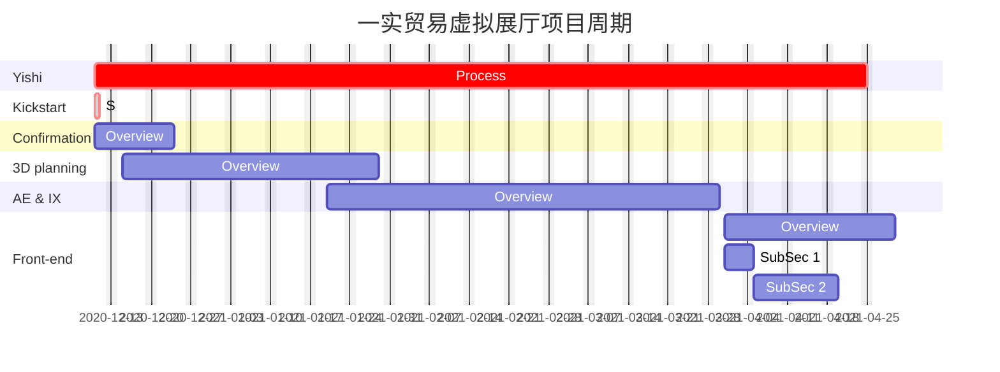

# Time control

```mermaid
gantt
    dateFormat  YYYY-MM-DD
    title       一实贸易虚拟展厅项目周期
    excludes    weekends
    %% (`excludes` accepts specific dates in YYYY-MM-DD format, days of the week ("sunday") or "weekends", but not the word "weekdays".)

    section Yishi
    Process  :crit, 2020-12-10, 2021-04-25

    section Kickstart
    S :crit, done, 2020/12/10, 2020-12-11

    section Confirmation
    Overview :, 2020-12-10, 2020-12-24

    section 3D planning
    Overview :, 2020-12-15, 2021-01-29

    section AE & IX
    Overview :, 2021-01-20, 2021-03-30

    section Front-end
    Overview :, 2021-03-31, 2021-04-30
    SubSec 1 :, 2021-03-31, 2021-04-05
    SubSec 2 :, 2021-04-05, 2021-04-20
```